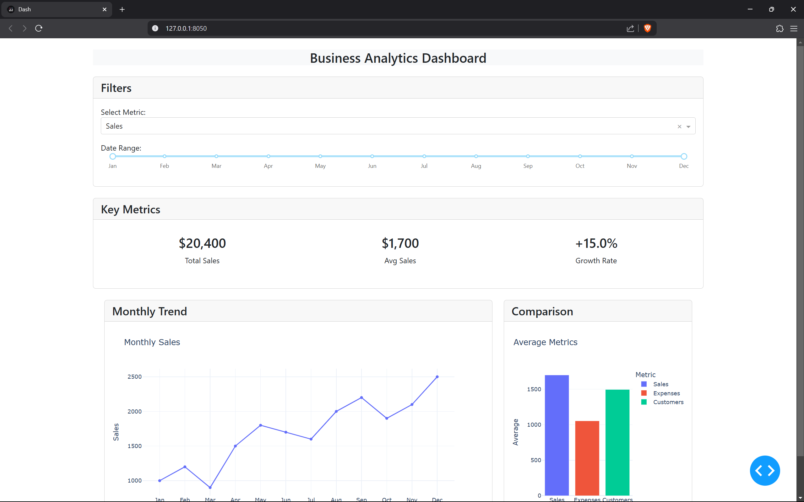
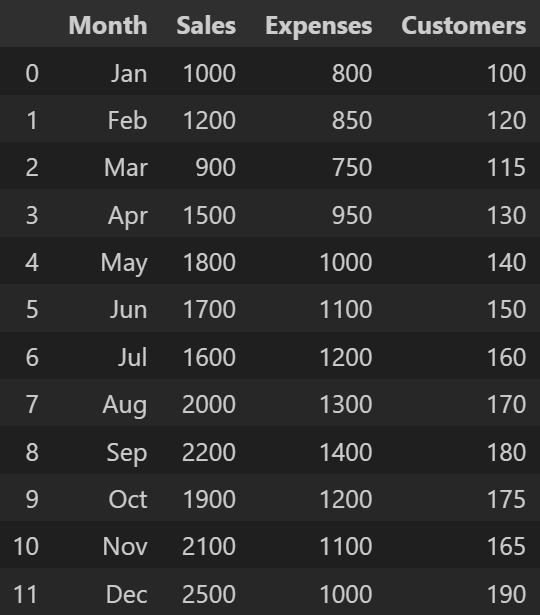
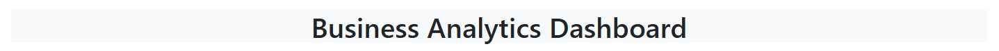
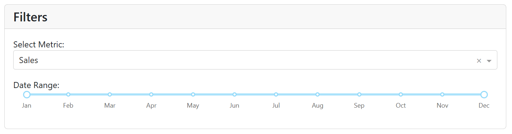
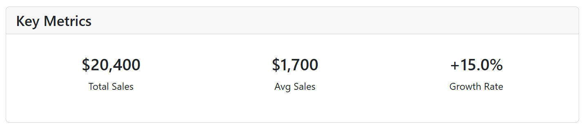
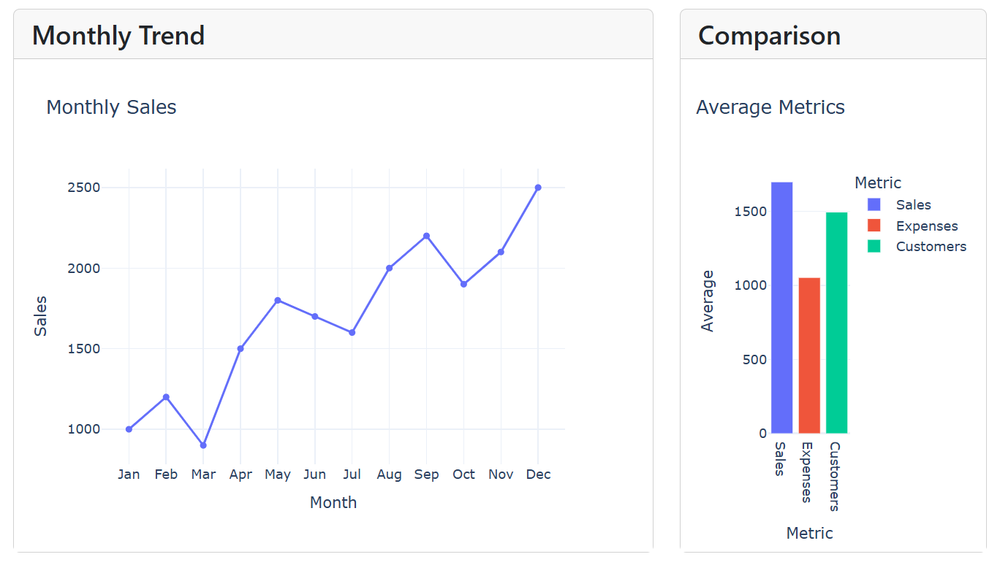
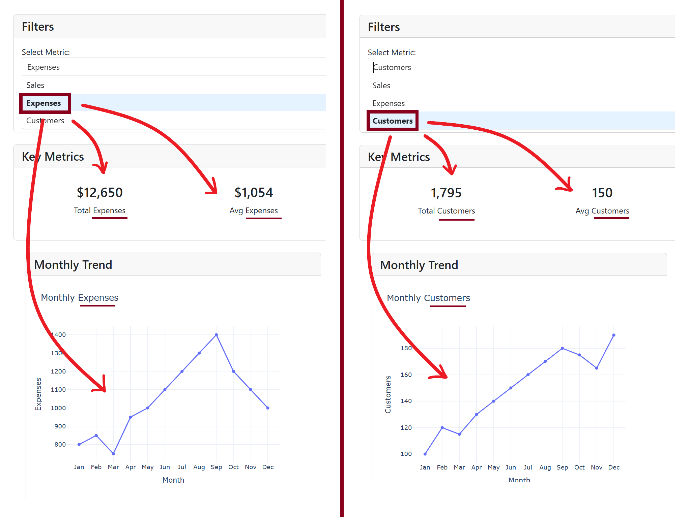

# Dashboard with Dash

This tutorial introduces you to building interactive web dashboards using **Dash**, a Python framework for creating analytical web applications. 

## Overview

This dashboard application allows users to:
- View monthly business metrics (Sales, Expenses, Customers)
- Filter data by date range
- See key performance indicators
- Visualize trends and comparisons through interactive charts

<div style="margin-top: 25px"></div>


## Project Structure

```
├── app.py            # Main application file
├── data.py           # Data loading and processing
├── layout.py         # Dashboard UI components
└── callbacks.py      # Interactive functionality
```
Always consider making a nice folder/file archicteture for bigger project.

## Getting Started

### Prerequisites

- Python 3.9
- Package manager: `pip` or `conda`

### Installation (virtual environment)

To set up the environment, you can choose between using Python's built-in venv module or the conda package manager, depending on your preference and existing setup.

```bash
python -m venv myenv
source venv/bin/activate  # On Windows: venv\Scripts\activate

pip install dash pandas plotly
```
Using conda package manager:
```bash
conda create --name myenv python=3.9
conda activate myenv

conda install -c conda-forge dash pandas plotly 
# conda install dash pandas plotly
# pip install dash pandas plotly
```

### Running the Application

```bash
python app.py
```

Navigate to http://127.0.0.1:8050/ in your web browser to view the dashboard.

## Dash Features Explained

### 1. Application Setup (app.py)

```python
import dash
from data import load_data
from layout import create_layout
from callbacks import register_callbacks

app = dash.Dash(
    __name__, 
    external_stylesheets=['https://cdnjs.cloudflare.com/ajax/libs/bootstrap/5.3.0/css/bootstrap.min.css']
)

df = load_data()
app.layout = create_layout(df)
register_callbacks(app, df)

if __name__ == '__main__':
    app.run_server(debug=True)
```

Key points:
- Dash app initialization with Bootstrap styling
- Modular code organization (separate files for data, layout, callbacks)
- Debug mode for development

### 2. Data Management (data.py)

```python
import pandas as pd

def load_data():
    return pd.DataFrame({
        'Month': ['Jan', 'Feb', 'Mar', 'Apr', 'May', 'Jun', 'Jul', 'Aug', 'Sep', 'Oct', 'Nov', 'Dec'],
        'Sales': [1000, 1200, 900, 1500, 1800, 1700, 1600, 2000, 2200, 1900, 2100, 2500],
        'Expenses': [800, 850, 750, 950, 1000, 1100, 1200, 1300, 1400, 1200, 1100, 1000],
        'Customers': [100, 120, 115, 130, 140, 150, 160, 170, 180, 175, 165, 190]
    })
```

<div style="margin-top: 25px; text-align:center">
        
</div>

Key point:
- Can be extended to load from CSV, databases, or APIs

### 3. Layout Construction (layout.py)

Dash uses a component-based approach for building UIs. Each element is a Python object that generates HTML.

#### Header Component

```python
def create_header():
    return html.Div([
        html.H3("Business Analytics Dashboard", className="text-center m-4")
    ], className="container bg-light")
```

<div style="margin-top: 25px; margin-bottom: 25px;">
    
</div>

Key features:
- `html` components for static elements (div, h3, label)
- Bootstrap **styling** through `className` attributes (text-center, m4, container, bg-light)

#### Filter Controls

```python
def create_filters(df):
    return html.Div([
        html.H4("Filters", className="card-header"),
        html.Div([
            html.Label("Select Metric:"),
            dcc.Dropdown(
                id='metric-dropdown',
                options=[
                    {'label': 'Sales', 'value': 'Sales'},
                    {'label': 'Expenses', 'value': 'Expenses'},
                    {'label': 'Customers', 'value': 'Customers'}
                ],
                value='Sales',
                className="mb-3"
            ),
            
            html.Label("Date Range:"),
            dcc.RangeSlider(
                id='month-slider',
                min=0,
                max=11,
                step=1,
                marks={i: df['Month'][i] for i in range(len(df['Month']))},
                value=[0, 11],
                className="mb-3"
            )
        ], className="card-body")
    ], className="card mb-4")
```

<div style="margin-top: 25px; margin-bottom: 25px;">
    
</div>

Key features:
- `html` components for static elements
- Bootstrap **styling** through `className` attributes
- `dcc` (Dash Core Components) for interactive elements:
  - Dropdown menus
  - Range sliders with custom marks


#### Metrics and Charts

```python
def create_key_metrics():
    return html.Div([
        html.H4("Key Metrics", className="card-header"),
        html.Div([
            html.Div([
                html.Div(id='total-sales', className="text-center p-3"),
                html.Div(id='avg-monthly', className="text-center p-3"),
                html.Div(id='growth-rate', className="text-center p-3")
            ], className="d-flex justify-content-around")
        ], className="card-body")
    ], className="card mb-4")
```

<div style="margin-top: 25px; margin-bottom: 25px;">
    
</div>

```python
def create_charts():
    return html.Div([
        html.Div([
            html.Div([
                html.H4("Monthly Trend", width="card-header"),
                dcc.Graph(id='line-chart')
            ], className="card mb-4")
        ], className="col-md-8"),
        
        html.Div([
            html.Div([
                html.H4("Comparison", width="card-header"),
                dcc.Graph(id='bar-chart')
            ], className="card mb-4")
        ], className="col-md-4")
    ], className="row container mx-auto")
```

<div style="margin-top: 25px; margin-bottom: 25px;">
    
</div>

Key features:
- `html` components for static element
- Bootstrap **styling** through `className` attributes
- Placeholder `dcc.Graph` components **with IDs for callback connections**

### 4. Interactive Callbacks (callbacks.py)

Callbacks connect user inputs to outputs, creating interactive functionality. For instance, a dropdown menu in a web application uses a callback to update displayed content based on the selected option :

<div style="margin-top: 25px; margin-bottom: 25px;">
    
</div>

```python
def register_callbacks(app, df):
    @app.callback(
        Output('line-chart', 'figure'),
        [Input('metric-dropdown', 'value'),
         Input('month-slider', 'value')]
    )
    def line_chart_callback(selected_metric, month_range):
        return update_line_chart(selected_metric, month_range, df)

    # Additional callbacks...
```

Key features:
- Decorator-based callback registration
- Input/Output connections between components
- Multiple inputs affecting a single output
- Multiple outputs from a single callback

#### Chart Generation with Plotly

```python
def update_line_chart(selected_metric, month_range, df):
    filtered_df = df.iloc[month_range[0]:month_range[1]+1]
    fig = px.line(
        filtered_df,
        x='Month',
        y=selected_metric,
        markers=True,
        title=f'Monthly {selected_metric}'
    )
    fig.update_layout(
        xaxis_title='Month',
        yaxis_title=selected_metric,
        template='plotly_white'
    )
    return fig
```

Key features:
- Plotly Express for simplified chart creation
- Dynamic filtering based on user selections
- Chart customization options

## Key Dash Concepts

### Component Hierarchy

Dash uses a component tree structure similar to React. Components can be nested to create complex layouts.

### Reactivity Through Callbacks

The callback system enables reactive updates without writing JavaScript:
1. User interacts with an input component
2. Callback function executes with new input values
3. Output component(s) update with callback results

### Stateless Design

Dash is primarily stateless - each callback executes independently. For persistent state:
- Use browser storage (dcc.Store)
- Maintain server-side state
- Use URL parameters

## Advanced Features

### Layout Patterns

1. **Responsive Design**
   - Bootstrap integration for grid layouts
   - Flex containers for component alignment

2. **Container Components**
   - Cards for grouping related elements
   - Consistent header styling

### Callback Patterns

1. **Chained Callbacks**
   - Output of one callback becomes input to another

2. **Multiple Outputs**
   - Single callback updating multiple components
   - Used for coordinated updates

3. **State vs. Input**
   - Inputs trigger callbacks when changed
   - State values are read but don't trigger callbacks

## Next Steps

Now that you understand the basics, try:
- Adding more interactive elements
- Creating additional pages
- Connecting to a real database
- Implementing more complex visualizations
